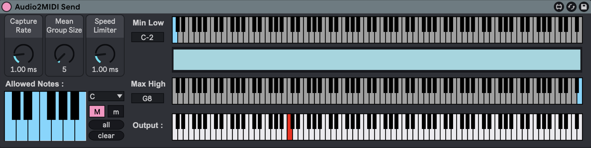
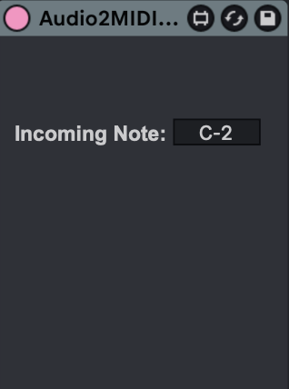

# Audio2Midi-m4L-Device
Rough and selective monophonic real time pitch to midi device for experimental music! It is meant to be imperfect, tad bit random but experimental. 

## Sender + Detector Device

It should be placed on any audio track (Max Audio Effect). 
User can choose the scale range, inclusive notes, and speed of detection.

## Reciever Device

It should be placed on any MIDI track (Max MIDI Effect) to recieve the detected MIDI. 

